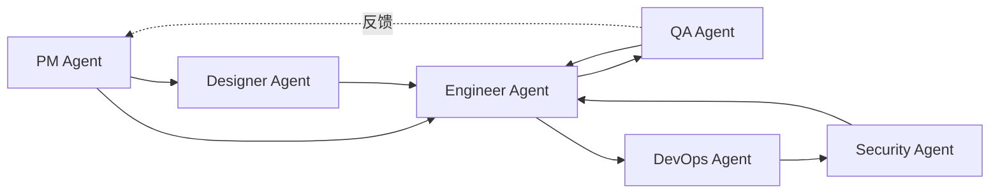

<div align="center">

# Neplich Agent Skills

面向软件交付全流程的 AI Agent 技能市场

[](#包含的-agent)
[](#包含的-agent)
[](LICENSE)

通过一个仓库统一发布 6 个可安装 Agent：
`pm-agent` • `engineer-agent` • `qa-agent` • `devops-agent` • `designer-agent` • `security-agent`

[快速开始](#使用方式) • [Agent 列表](#包含的-agent) • [架构说明](#协作流程) • [开发指南](#开发说明)

</div>

---

## 概览

Neplich Agent Skills 是一个**多 Agent 协作市场**，为软件交付流程提供端到端的 AI 能力支持。从产品需求到安全审查，6 个专业 Agent 覆盖完整的开发生命周期。

### 核心特性

- **角色化分工** - 每个 Agent 专注一个领域，避免能力混杂
- **文档驱动** - Agent 之间通过标准化文档协作，而非紧耦合
- **独立安装** - 按需安装所需 Agent，无需全量引入
- **可扩展架构** - 标准化的 Skill 结构，易于添加新能力

### 适用场景

- 小团队需要 AI 辅助完成产品开发全流程
- 个人开发者希望系统化管理项目文档和代码
- 需要标准化的软件交付流程和质量保障

> [!NOTE]
> 该仓库本身是 marketplace 源。用户需先添加 marketplace，再按需安装 Agent。

## 包含的 Agent

| Agent | 职责范围 | Skills | 文档 |
| --- | --- | :---: | --- |
| **pm-agent** | 产品需求、竞品分析、路线图规划、版本管理 | 7 | [查看详情](./agents/product_manager/README.md) |
| **engineer-agent** | 代码分析、项目搭建、功能实现、测试、调试 | 6 | [查看详情](./agents/engineer/README.md) |
| **qa-agent** | 探索测试、规范测试、Bug 分析、回归验证 | 4 | [查看详情](./agents/qa/README.md) |
| **devops-agent** | 部署规划、CI/CD 搭建、环境审计、故障处理 | 4 | [查看详情](./agents/devops/README.md) |
| **designer-agent** | UI/UX 设计、视觉系统、界面原型 | 2 | [查看详情](./agents/designer/README.md) |
| **security-agent** | 安全审查、权限检查、依赖审计、隐私合规 | 4 | [查看详情](./agents/security/README.md) |

**总计：6 个 Agent，27 个 Skills**

## 协作流程

Agent 之间通过文档进行协作，形成完整的软件交付链：



**典型工作流：**

1. **PM Agent** 产出 PRD、BRD、TRD 等需求文档
2. **Designer Agent** 基于需求设计 UI/UX 和视觉系统
3. **Engineer Agent** 根据文档和设计实现功能
4. **QA Agent** 执行测试并反馈问题
5. **DevOps Agent** 配置部署环境和 CI/CD
6. **Security Agent** 进行安全审查和合规检查

## 使用方式

### 安装

```bash
# 1. 添加 marketplace
/plugin marketplace add neplich/neplich-skills

# 2. 安装所需的 Agent
/plugin install pm-agent@neplich-agent-skills
/plugin install engineer-agent@neplich-agent-skills
/plugin install qa-agent@neplich-agent-skills
/plugin install devops-agent@neplich-agent-skills
/plugin install designer-agent@neplich-agent-skills
/plugin install security-agent@neplich-agent-skills
```

### 使用示例

安装后，可以直接调用各 Agent 的 skills：

```bash
# PM Agent - 生成产品需求文档
/idea-to-spec

# Designer Agent - 设计 UI/UX
/ui-ux-design

# Engineer Agent - 实现功能
/feature-implementor

# QA Agent - 执行测试
/spec-based-tester

# DevOps Agent - 规划部署
/deployment-planner

# Security Agent - 安全检查
/appsec-checklist
```

## 仓库结构

```text
neplich-skills/
├── .claude-plugin/
│   └── marketplace.json      # Marketplace 配置
├── agents/
│   ├── product_manager/      # PM Agent
│   ├── engineer/             # Engineer Agent
│   ├── qa/                   # QA Agent
│   ├── devops/               # DevOps Agent
│   ├── designer/             # Designer Agent
│   └── security/             # Security Agent
├── skills-lock.json          # Skills 锁定信息
└── CLAUDE.md                 # 仓库开发指南
```

每个 Agent 的目录结构：

```text
agents/{agent-name}/
├── README.md                 # Agent 说明文档
├── skills/                   # Skills 实现
│   └── {skill-name}/
│       ├── SKILL.md          # Skill 公开文档
│       └── _internal/
│           └── INSTRUCTIONS.md  # AI 实现指南
└── test/                     # 评估测试
    └── {skill-name}/
        └── evals/
            └── evals.json    # 测试用例
```

## 开发说明

### 添加新 Skill

1. 在对应 Agent 的 `skills/` 目录下创建新 skill
2. 编写 `SKILL.md`（用户文档）和 `_internal/INSTRUCTIONS.md`（AI 指南）
3. 在 `test/` 目录添加评估测试
4. 更新 `.claude-plugin/marketplace.json` 注册 skill
5. 运行测试验证效果

### 添加新 Agent

参考 `CLAUDE.md` 中的详细指南，包含完整的 Agent 创建流程。

### 设计原则

- **文档驱动** - Skills 消费和产出 Markdown 文档
- **技术栈无关** - 不绑定特定框架或工具
- **最小化职责** - 每个 Skill 专注一个明确任务
- **独立可用** - Skills 可单独使用，也可组合使用

---

<div align="center">

**[查看完整文档](./CLAUDE.md)** • **[贡献指南](./CONTRIBUTING.md)** • **[问题反馈](../../issues)**

</div>
