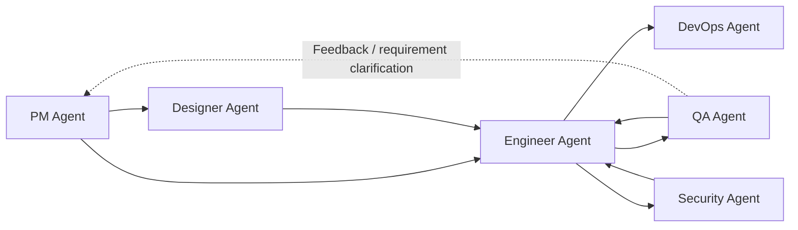

<div align="center">

# Dev Agent Skills

Multi-agent skills for the full software delivery lifecycle.

[](#agents)
[](#agents)
[](LICENSE)

`pm-agent` • `engineer-agent` • `qa-agent` • `devops-agent` • `designer-agent` • `security-agent`

[Quick Start](#quick-start) • [Agents](#agents) • [How They Work Together](#how-they-work-together) • [Repository Structure](#repository-structure)

</div>

> [!NOTE]
> Other Languages: [中文](./README_zh.md)

## Overview

This repository publishes six role-based agents in one shared source, covering the full path from product planning to design, implementation, testing, deployment, and security review.

It is structured as a reusable skill marketplace with:

- 6 dispatcher skills, one per agent
- 27 specialist skills
- document-driven, on-demand collaboration between agents
- installation support for both Claude Code and Codex

## Agents

| Agent | Focus Area | Skills | Entry Command | Docs |
| --- | --- | :---: | --- | --- |
| `pm-agent` | specs, roadmaps, changelogs, release notes, GitHub project status | 8 (`1 + 7`) | `/pm-agent` | [product_manager](./agents/product_manager/README.md) |
| `engineer-agent` | codebase analysis, bootstrapping, implementation, testing, debugging, delivery | 7 (`1 + 6`) | `/engineer-agent` | [engineer](./agents/engineer/README.md) |
| `qa-agent` | spec-based testing, exploratory testing, bug reports, regression validation | 5 (`1 + 4`) | `/qa-agent` | [qa](./agents/qa/README.md) |
| `devops-agent` | deployment planning, CI/CD, config audits, incident playbooks | 5 (`1 + 4`) | `/devops-agent` | [devops](./agents/devops/README.md) |
| `designer-agent` | UI/UX design and visual systems | 3 (`1 + 2`) | `/designer-agent` | [designer](./agents/designer/README.md) |
| `security-agent` | application security, authz review, dependency risk, privacy mapping | 5 (`1 + 4`) | `/security-agent` | [security](./agents/security/README.md) |

> [!TIP]
> Start with the agent entry command whenever possible. The dispatcher skill decides which specialist skill to run next.

## Skill Layout

Each agent skill group has two layers:

- one dispatcher skill with the same name as the agent, such as `pm-agent` or `engineer-agent`
- multiple specialist skills, such as `idea-to-spec`, `feature-implementor`, or `spec-based-tester`

This gives you two ways to work:

- use the agent entry command for intent-based routing
- call a specialist skill directly when you already know the exact capability you need

## How They Work Together

These agents collaborate through Markdown documents and project assets rather than a shared runtime.



A few common invocation patterns:

1. `pm-agent -> engineer-agent -> qa-agent`
2. `pm-agent -> designer-agent -> engineer-agent -> qa-agent`
3. `engineer-agent <-> qa-agent` for bugfix and regression loops
4. `engineer-agent -> devops-agent` when deployment or CI/CD work is needed
5. `engineer-agent -> security-agent` when security review is needed

Not every project needs all six agents. Each agent is designed to complete a meaningful role-specific loop on its own, and cross-agent handoff happens only when another role is needed.

When QA finds a requirement gap, acceptance issue, or prioritization problem instead of a pure implementation bug, the user can route the result back to `pm-agent` instead of `engineer-agent`.

## Quick Start

### Claude Code

```bash
# Add the marketplace
/plugin marketplace add Neplich/dev-agent-skills

# Install the agents you want
/plugin install pm-agent@dev-agent-skills
/plugin install engineer-agent@dev-agent-skills
/plugin install qa-agent@dev-agent-skills
/plugin install devops-agent@dev-agent-skills
/plugin install designer-agent@dev-agent-skills
/plugin install security-agent@dev-agent-skills
```

### Codex

In Codex, say:

```text
Fetch and follow instructions from https://raw.githubusercontent.com/Neplich/dev-agent-skills/refs/heads/main/.codex/INSTALL.md
```

The install flow will first ask:

- whether this should be a `personal` or `project` install
- whether to install `all` agents or a selected subset

See [docs/README.codex.md](./docs/README.codex.md) for the full Codex guide.

## Usage Examples

```text
/pm-agent "I want to build a task management app"
/designer-agent "Design the login flow"
/engineer-agent "Implement the login feature"
/qa-agent "Test the login flow"
/devops-agent "Set up CI/CD"
/security-agent "Run a pre-release security review"
```

If you already know the exact specialist skill you want, you can call it directly:

```text
/idea-to-spec
/github-reader
/feature-implementor
/ui-ux-design
/regression-suite
/deployment-planner
/appsec-checklist
```

## Updating

```bash
# Claude Code
/plugin update pm-agent@dev-agent-skills
/plugin update

# Codex (personal)
git -C "$HOME/.codex/dev-agent-skills" pull --ff-only

# Codex (project)
git -C "$PWD/.codex/dev-agent-skills" pull --ff-only
```

## Repository Structure

```text
neplich-skills/
├── .claude-plugin/          # Claude Code marketplace configuration
├── .codex/                  # Codex installation entrypoint
├── agents/                  # all agent skill groups
├── docs/                    # public-facing docs
├── skills-lock.json         # skill metadata lock file
├── CLAUDE.md                # Claude Code repository guidance
└── AGENTS.md                # shared agent guidance
```

Each agent follows the same structure:

```text
agents/{agent}/
├── README.md
├── skills/
│   └── {skill}/
│       ├── SKILL.md
│       └── _internal/
│           └── INSTRUCTIONS.md
└── test/
    └── {skill}/
        └── evals/
            └── evals.json
```

## Good Fit

- Teams that want a document-driven AI delivery workflow across product, design, engineering, QA, DevOps, and security
- Developers who prefer installing role-based agents instead of one large mixed skill pack
- Repositories that need reviewable Markdown artifacts between phases
- Users who want to reuse the same agent set in both Claude Code and Codex

## Maintenance Notes

- Follow the existing `agents/*` structure when adding new agents or specialist skills
- Keep `CLAUDE.md` and `AGENTS.md` in sync
- Treat `docs/superpowers/` as working docs only; it is not meant for versioned public documentation

<div align="center">

[Chinese README](./README_zh.md) • [Claude Guide](./CLAUDE.md) • [Agents Guide](./AGENTS.md) • [Codex Guide](./docs/README.codex.md)

</div>
