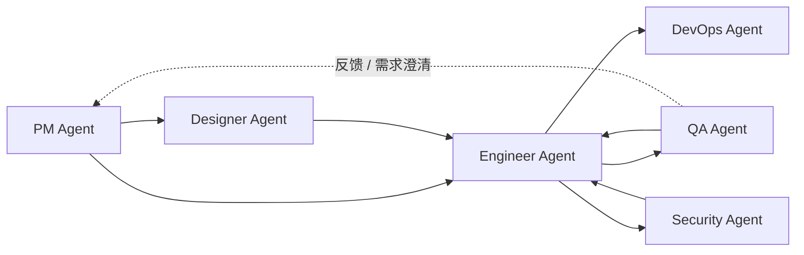

<div align="center">

# Dev Agent Skills

面向软件交付全流程的多 Agent 技能市场。

[](#agents)
[](#agents)
[](LICENSE)

`pm-agent` • `engineer-agent` • `qa-agent` • `devops-agent` • `designer-agent` • `security-agent`

[快速开始](#快速开始) • [Agents](#agents) • [协作方式](#协作方式) • [仓库结构](#仓库结构)

</div>

> [!NOTE]
> 其他语言：[English](./README.md)

## 概览

这个仓库把 6 个按角色划分的 Agent 集中发布在同一个 marketplace/source 里，用来覆盖一条完整的软件交付链：需求、设计、实现、测试、部署和安全审查。

你可以把它理解成一套可安装、可组合的工作流技能包：

- 6 个 Agent dispatcher skills
- 27 个专业子 skills
- 文档驱动、按需调用的 Agent 协作方式
- 同时支持 Claude Code 和 Codex

> [!NOTE]
> Claude Code 通过 marketplace 安装；Codex 通过原生 skill discovery 安装。

## Agents

| Agent | 关注范围 | Skills | 入口 | 文档 |
| --- | --- | :---: | --- | --- |
| `pm-agent` | 创意到规格、路线图、版本日志、发布说明、GitHub 项目状态 | 8 (`1 + 7`) | `/pm-agent` | [product_manager](./agents/product_manager/README.md) |
| `engineer-agent` | 代码分析、项目搭建、功能实现、测试、调试、交付 | 7 (`1 + 6`) | `/engineer-agent` | [engineer](./agents/engineer/README.md) |
| `qa-agent` | 规范测试、探索测试、Bug 报告、回归验证 | 5 (`1 + 4`) | `/qa-agent` | [qa](./agents/qa/README.md) |
| `devops-agent` | 部署规划、CI/CD、环境配置审计、故障手册 | 5 (`1 + 4`) | `/devops-agent` | [devops](./agents/devops/README.md) |
| `designer-agent` | UI/UX 设计、视觉系统设计 | 3 (`1 + 2`) | `/designer-agent` | [designer](./agents/designer/README.md) |
| `security-agent` | 应用安全、授权审查、依赖风险、隐私合规 | 5 (`1 + 4`) | `/security-agent` | [security](./agents/security/README.md) |

> [!TIP]
> 推荐优先使用 Agent 入口命令，例如 `/pm-agent` 或 `/engineer-agent`。入口 skill 会先判断意图，再选择合适的子 skill。

## Skill 组织

每个 Agent skill 组都包含两层：

- 一个同名 dispatcher skill，例如 `pm-agent`、`engineer-agent`
- 多个可直接调用的 specialist skills，例如 `idea-to-spec`、`feature-implementor`、`spec-based-tester`

这让你既可以用入口命令做高层调度，也可以在你已经知道目标能力时直接调用子 skill。

## 协作方式

这些 Agent 不依赖共享状态机，而是通过文档和项目资产协作：



几条常见调用方式是：

1. `pm-agent -> engineer-agent -> qa-agent`
2. `pm-agent -> designer-agent -> engineer-agent -> qa-agent`
3. `engineer-agent <-> qa-agent` 的缺陷修复与回归循环
4. `engineer-agent -> devops-agent`，在需要部署或 CI/CD 时介入
5. `engineer-agent -> security-agent`，在需要安全审查时介入

不是所有项目都必须跑完整条 6-agent 链。每个 agent 都应该先完成自己的角色闭环，只有在需要跨角色协作时才发生 handoff。

如果 QA 在测试中发现的是需求缺口、验收标准问题或优先级变化，而不是单纯实现缺陷，用户可以把同一份反馈材料交给 `pm-agent` 继续处理，而不是一定回到 `engineer-agent`。

## 快速开始

### Claude Code

```bash
# 添加 marketplace
/plugin marketplace add Neplich/dev-agent-skills

# 安装所需 Agent
/plugin install pm-agent@dev-agent-skills
/plugin install engineer-agent@dev-agent-skills
/plugin install qa-agent@dev-agent-skills
/plugin install devops-agent@dev-agent-skills
/plugin install designer-agent@dev-agent-skills
/plugin install security-agent@dev-agent-skills
```

### Codex

在 Codex 中输入：

```text
Fetch and follow instructions from https://raw.githubusercontent.com/Neplich/dev-agent-skills/refs/heads/main/.codex/INSTALL.md
```

安装流程会先确认两件事：

- 安装到 `personal` 还是 `project` 层级
- 安装 `all` agents，还是从多个 agents 中选择

完整说明见 [docs/README.codex.md](./docs/README.codex.md)。

## 使用示例

```text
/pm-agent "我想做一个任务管理应用"
/designer-agent "设计用户登录界面"
/engineer-agent "实现用户登录功能"
/qa-agent "测试登录功能"
/devops-agent "配置 CI/CD"
/security-agent "做一轮发布前安全审查"
```

如果你已经明确知道要调用哪个子 skill，也可以直接使用：

```text
/idea-to-spec
/github-reader
/feature-implementor
/ui-ux-design
/regression-suite
/deployment-planner
/appsec-checklist
```

## 更新

```bash
# Claude Code
/plugin update pm-agent@dev-agent-skills
/plugin update

# Codex (personal)
git -C "$HOME/.codex/dev-agent-skills" pull --ff-only

# Codex (project)
git -C "$PWD/.codex/dev-agent-skills" pull --ff-only
```

## 仓库结构

```text
neplich-skills/
├── .claude-plugin/          # Claude Code marketplace 配置
├── .codex/                  # Codex 安装入口
├── agents/                  # 6 个 Agent 及其 skills
├── docs/                    # 对外文档
├── skills-lock.json         # skill 元数据锁文件
├── CLAUDE.md                # Claude Code 仓库说明
└── AGENTS.md                # 通用 Agent 仓库说明
```

单个 Agent 的结构遵循统一约定：

```text
agents/{agent}/
├── README.md
├── skills/
│   └── {skill}/
│       ├── SKILL.md
│       └── _internal/
│           └── INSTRUCTIONS.md
└── test/
    └── {skill}/
        └── evals/
            └── evals.json
```

## 适合什么场景

- 想把需求、设计、实现、测试、部署和安全审查串成一条标准交付链
- 需要按角色安装 AI skills，而不是引入一大包混杂能力
- 希望 Agent 之间通过可审阅的 Markdown 文档协作
- 想在 Claude Code 和 Codex 里复用同一套 Agent 资产

## 维护说明

如果你要继续扩展这个仓库：

- 新增 Agent 或 skill 时，优先遵循现有 `agents/*` 目录结构
- `CLAUDE.md` 与 `AGENTS.md` 需要保持一致

<div align="center">

[English README](./README.md) • [Claude Guide](./CLAUDE.md) • [Agents Guide](./AGENTS.md) • [Codex Guide](./docs/README.codex.md)

</div>
