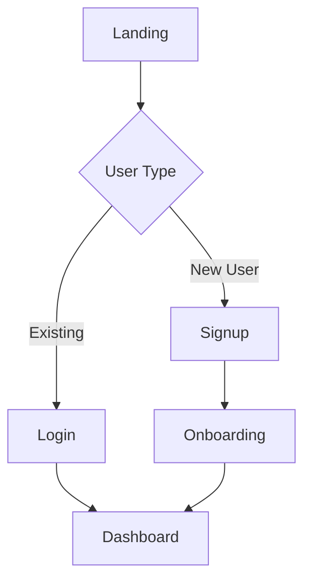

# UI/UX Design Instructions

## Overview

This skill designs user experience flows and interface specifications based on PM documents. It can optionally analyze reference websites to match design patterns and styles.

## Execution Steps

### Step 1: Gather Requirements

1. **Read PM documents** from `docs/` directory:
   - PRD: feature requirements, user stories, use cases
   - BRD: target users, business goals, brand tone
   - TRD: technical constraints, performance requirements

2. **Ask for reference websites** using AskUserQuestion:
   ```
   Question: "Do you have any favorite websites or design references we should follow?"
   Options:
   - "Yes, I have reference websites" (provide URL input)
   - "No, create an original design"
   ```

### Step 2: Analyze Reference (if provided)

If user provides reference website URL:

1. **Fetch reference website** using WebFetch
2. **Extract design patterns**:
   - Layout structure (header/nav/content/footer)
   - Navigation patterns (top nav, sidebar, hamburger)
   - Information architecture
   - Interaction patterns (cards, lists, modals)
   - Visual hierarchy

3. **Document findings** in a temporary analysis note

### Step 3: Design User Journey

Create user journey map using Mermaid flowchart:



Include:
- Main task flows
- Decision points
- Edge cases (empty states, errors, loading)


### Step 4: Create Page Inventory

List all required pages/screens:

```markdown
## Page Inventory

1. **Landing Page** - Marketing homepage
2. **Login/Signup** - Authentication
3. **Dashboard** - Main user interface
4. **Settings** - User preferences
5. **[Feature Page]** - Specific feature screens
```

### Step 5: Design ASCII Prototypes

For each major page, create ASCII layout prototype:

```
┌─────────────────────────────────────────────────┐
│  [Logo]              [Nav Links]      [Profile] │
├─────────────────────────────────────────────────┤
│                                                  │
│  ┌────────────────┐  ┌────────────────┐        │
│  │                │  │                │        │
│  │   Card Title   │  │   Card Title   │        │
│  │   [Image]      │  │   [Image]      │        │
│  │   Description  │  │   Description  │        │
│  │   [Button]     │  │   [Button]     │        │
│  │                │  │                │        │
│  └────────────────┘  └────────────────┘        │
│                                                  │
├─────────────────────────────────────────────────┤
│  Footer: Links | Contact | © 2026              │
└─────────────────────────────────────────────────┘
```

Use box-drawing characters: ┌ ┐ └ ┘ ├ ┤ ─ │


### Step 6: Define Component List

List all UI components needed:

```markdown
## Component List

### Navigation
- Header with logo and nav links
- Mobile hamburger menu
- Breadcrumbs

### Content
- Card component (image, title, description, action)
- List items
- Data tables
- Forms (input, select, checkbox, radio)

### Feedback
- Modals/dialogs
- Toast notifications
- Loading spinners
- Empty states
- Error messages
```


### Step 7: Document Interactions

Describe key interactions and behaviors:

```markdown
## Interaction Behaviors

### Navigation
- Click logo → return to homepage
- Hover nav links → show underline
- Mobile: hamburger menu slides from left

### Forms
- Input focus → show blue border
- Validation → inline error messages
- Submit → loading state → success/error feedback

### Cards
- Hover → slight elevation shadow
- Click → navigate to detail page
```

### Step 8: Handle Responsive Design

Document responsive breakpoints:

```markdown
## Responsive Design

### Desktop (>1024px)
- 3-column card grid
- Full navigation visible

### Tablet (768px-1024px)
- 2-column card grid
- Condensed navigation

### Mobile (<768px)
- 1-column stack
- Hamburger menu
- Touch-friendly buttons (min 44px)
```


### Step 9: Generate Output Document

Create `docs/design/ui-ux-spec.md` with the following structure:

```markdown
# UI/UX Design Specification

## 1. Reference Analysis (if applicable)
- Reference URL: [url]
- Key patterns extracted: [list]

## 2. User Journey
[Mermaid flowchart]

## 3. Page Inventory
[List of all pages]

## 4. Page Layouts
[ASCII prototypes for each page]

## 5. Component List
[All UI components needed]

## 6. Interaction Behaviors
[Key interactions and states]

## 7. Responsive Design
[Breakpoints and adaptations]
```

## Quality Checklist

Before finalizing, ensure:
- [ ] All user flows are covered (happy path + edge cases)
- [ ] ASCII prototypes are clear and readable
- [ ] Component list is complete
- [ ] Interactions are well-defined
- [ ] Responsive design is addressed
- [ ] Reference patterns (if any) are properly adapted

## Output Location

Write the final document to: `docs/design/ui-ux-spec.md`
