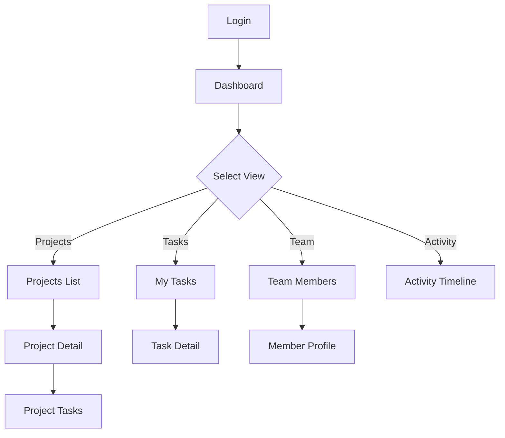

# UI/UX Design Specification

## 1. Reference Analysis
No reference website provided - creating original design.

## 2. User Journey



## 3. Page Inventory

1. **Dashboard** - Overview with quick stats and recent activity
2. **Projects List** - All projects with status
3. **Project Detail** - Single project view with tasks
4. **My Tasks** - User's assigned tasks
5. **Team Members** - Team directory
6. **Activity Timeline** - Recent updates feed


## 4. Page Layouts

### Dashboard Layout

```
┌─────────────────────────────────────────────────────────────┐
│  [Logo] Project Manager    Projects Tasks Team    [Profile] │
├─────────────────────────────────────────────────────────────┤
│                                                               │
│  Dashboard                                                    │
│                                                               │
│  ┌──────────┐  ┌──────────┐  ┌──────────┐  ┌──────────┐   │
│  │ Active   │  │ Tasks    │  │ Team     │  │ Overdue  │   │
│  │ Projects │  │ Pending  │  │ Members  │  │ Tasks    │   │
│  │   12     │  │   34     │  │   8      │  │   3      │   │
│  └──────────┘  └──────────┘  └──────────┘  └──────────┘   │
│                                                               │
│  Recent Activity                                              │
│  ┌─────────────────────────────────────────────────────┐   │
│  │ • John completed "Design mockups" - 2 min ago       │   │
│  │ • Sarah added comment on "API Integration"          │   │
│  │ • New project "Mobile App" created                  │   │
│  └─────────────────────────────────────────────────────┘   │
│                                                               │
└─────────────────────────────────────────────────────────────┘
```


### Projects List Layout

```
┌─────────────────────────────────────────────────────────────┐
│  [Logo] Project Manager    Projects Tasks Team    [Profile] │
├─────────────────────────────────────────────────────────────┤
│                                                               │
│  Projects                              [+ New Project]       │
│                                                               │
│  ┌─────────────────────────────────────────────────────┐   │
│  │ Mobile App Redesign          [Active]   [View]      │   │
│  │ 12 tasks • 3 members • Due: Mar 30                  │   │
│  └─────────────────────────────────────────────────────┘   │
│                                                               │
│  ┌─────────────────────────────────────────────────────┐   │
│  │ API Integration              [In Progress] [View]   │   │
│  │ 8 tasks • 2 members • Due: Apr 5                    │   │
│  └─────────────────────────────────────────────────────┘   │
│                                                               │
└─────────────────────────────────────────────────────────────┘
```

## 5. Component List

### Navigation
- Top navigation bar with logo and main links
- User profile dropdown

### Content
- Stat cards (4-column grid)
- Project cards (title, status, metadata, action button)
- Task list items (checkbox, title, assignee, due date)
- Activity feed items (icon, text, timestamp)

### Feedback
- Status badges (Active, In Progress, Completed)
- Empty states ("No projects yet")
- Loading spinners


## 6. Interaction Behaviors

### Navigation
- Click logo → return to dashboard
- Click nav links → navigate to respective pages
- Profile dropdown → show logout, settings

### Projects
- Click project card → view project detail
- Hover project card → show shadow elevation
- Click [+ New Project] → open create modal

### Tasks
- Click checkbox → mark task complete
- Click task → open task detail modal

## 7. Responsive Design

### Desktop (>1024px)
- 4-column stat cards
- Full navigation visible
- Sidebar + main content layout

### Tablet (768px-1024px)
- 2-column stat cards
- Condensed navigation

### Mobile (<768px)
- 1-column stack
- Hamburger menu
- Bottom navigation for main actions
