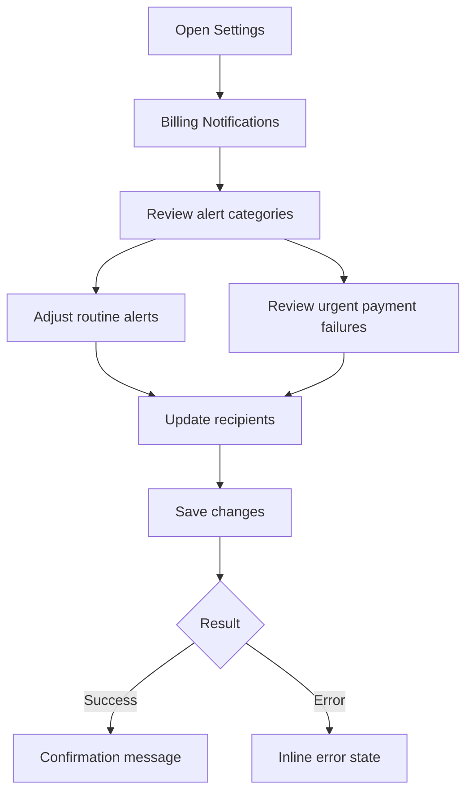

# UI/UX Design Specification

## 1. Reference Analysis

No external reference site provided. Extend the existing settings shell with a
calm but operationally clear billing alerts experience.

## 2. User Journey



## 3. Page Inventory

1. **Billing Notifications Settings** - Main workspace-level notification setup
2. **Recipient Edit State** - Inline editing mode for shared email aliases
3. **Save Confirmation State** - Success acknowledgement after settings persist

## 4. Page Layouts

### Billing Notifications Settings

```
┌──────────────────────────────────────────────────────────────┐
│ Settings / Billing                                           │
├──────────────────────────────────────────────────────────────┤
│ Billing Notifications                                        │
│ Workspace-wide rules for finance and payment alerts          │
│                                                              │
│  ┌────────────────────────────────────────────────────────┐  │
│  │ Urgent Alerts                                         │  │
│  │ [!] Payment failed                                    │  │
│  │ Immediate delivery to owners and finance alias        │  │
│  │ [Toggle On]   [View recipient rules]                  │  │
│  └────────────────────────────────────────────────────────┘  │
│                                                              │
│  ┌────────────────────────────────────────────────────────┐  │
│  │ Routine Alerts                                        │  │
│  │ [ ] Invoice issued     [ ] Reminder before due date   │  │
│  │ [ ] Invoice overdue                                   │  │
│  └────────────────────────────────────────────────────────┘  │
│                                                              │
│  Recipients                                                  │
│  ┌────────────────────────────────────────────────────────┐  │
│  │ finance@workspace.com     [Primary]      [Edit]       │  │
│  │ ops@workspace.com                         [Remove]     │  │
│  │ [+ Add recipient]                                     │  │
│  └────────────────────────────────────────────────────────┘  │
│                                                              │
│  Changes apply to the whole workspace.                       │
│                                              [Cancel][Save] │
└──────────────────────────────────────────────────────────────┘
```

## 5. Component List

### Messaging

- Page header with scope description
- Workspace-wide impact notice
- Success confirmation banner
- Inline error message block

### Controls

- Toggle rows for alert categories
- Editable recipient list with primary badge
- Add recipient action
- Save and cancel actions

### State Indicators

- Urgency icon for payment failure alerts
- Loading state for save action
- Empty state when no secondary recipients exist

## 6. Interaction Behaviors

### Alert Preferences

- Toggle urgent payment-failure alerts separately from routine billing reminders
- Keep urgent alerts pinned above routine options
- Show explanatory helper copy when urgent alerts are disabled

### Recipient Editing

- Clicking `Edit` converts the alias row into inline editable fields
- Adding a recipient preserves the current page context instead of opening a new
  screen
- Removing the primary alias requires selecting another primary recipient first

### Feedback States

- Save success shows a page-level confirmation banner
- Save failure keeps the user on the page and attaches guidance near the failing
  field or action area
- Loading disables the save action and keeps cancel available

## 7. Responsive Design

### Desktop (>1024px)

- Single-column settings form with full-width urgency and recipient panels

### Tablet (768px-1024px)

- Keep the same vertical flow with tighter panel padding

### Mobile (<768px)

- Stack all controls in a single column
- Promote save action to a sticky footer bar
- Expand recipient rows into vertically grouped blocks
